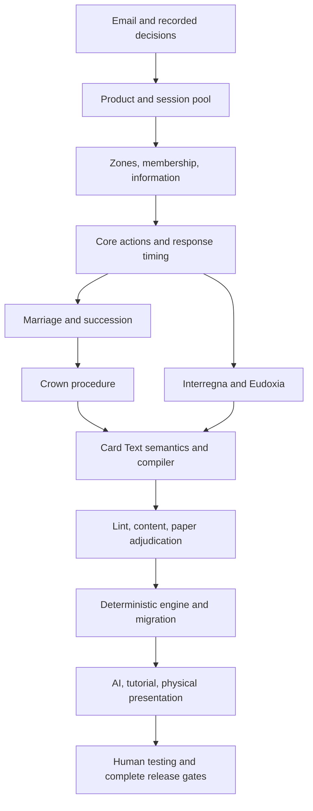

# Overlords & Outlaws — The Weight of the Crown

> **Current playable revision:** [Read the card: sixth-grade language revision](CARD-LANGUAGE-REVISION.md) supersedes the original card wording, blank Noble faces, A2/P2 selectors and compiler architecture below. The remainder preserves the original design proposal and its evidence. The executable roster is in `src/history-engine/content.ts`.

**Final implementation specification · 16 September 2026 · revision R3**

**Document status:** proposed replacement design, not an implemented ruleset or a release authorization. The September 16 decisions cited below are binding inputs; new rules in this document are the proposal requested by Bradd. They must not be backfilled into the questionnaire as answers from the user. Original concept and supplied source work: **Overlords & Outlaws © 2025 Malachy Murray**.

## 1. The decision

Make O&O a game of **concealed dynastic leverage, negotiated access and disputed succession**. A player wins by establishing a government, surviving the historical and political consequences of public rule, and transferring that rule to a lawful successor. Characters are people with affiliations and relationships. They have no attack, health, mana cost or contribution to an aggregate victory score.

The central question is: **“If this person leaves, who can still govern—and who holds the dynastic connection that could change the answer?”** Affiliation is not proof of direct kinship: the engine uses printed affiliation, roles and explicitly modeled relationships, not an invented complete genealogy.

Malachy's email in [Review Malachy email themes](codex://threads/01a0ac6c-e6b1-7063-82b3-7a6405894d65) is the primary design brief. In particular:

> “Gold, costs, damage and points may be useful scaffolding while we're getting the machine running, but ultimately I’m trying to discover whether history itself can provide more of the engine.”

The answer is a testable **yes as a design hypothesis**, not a claim of demonstrated fun. History can determine admission, legitimacy, succession, obligations and the conditions that break them. Those are executable rules. A historical name above a damage number does not satisfy this brief.

### Product contract

- A manufactured physical card-and-board game, digitally prototyped for two to four players; solo play uses two or three AI opponents. A core box contains four mechanically distinct, fixed-content Dynasty modules. Expansions are complete modules, not randomized boosters or individually constructed decks.
- Players choose N modules for N players and combine their contents. A chosen module is not assigned to a player. Players establish their Dynasty through Inheritance.
- Target experience: a readable, tense family strategy game with bargaining, reversals and memorable people, attractive to experienced card players without requiring their vocabulary. Initial usability cohort: age 12+ alongside adults; this is a testing hypothesis, not a certified age rating. Target normal duration 40–65 minutes after learning; teach and setup are measured separately.
- The browser presents the physical game as a beautiful cabinet of history: cards, seals, a sculptural Crown, marriage links and a gradually assembled painting. It adds inspection and causal presentation, not software-only rules.

### Structural distance from character combat

Remove gold, printed costs, attacks on people, damage, health, Stability, estates/income/upkeep, Guardian targeting, Brace, damage retaliation, numeric authority, power totals, Crown health and point thresholds. Do not replace them with influence, prestige or lore counters.

Retain a small **action allowance** and finite physical components. Counting three available opportunities is not the strategic engine; matching a Dynasty, exposing a person, arranging a marriage and preserving an heir are. There is no fungible currency to farm, no numerical combat comparison and no engine that wins by incrementing a total. A larger Court supplies options and creates additional exposed relationships; it does not grant additional action allowances.

**Reskin test:** replace all four Laws with one generic collect-and-hold condition while leaving the same people, seals and draw order. If bargaining targets, concealment choices and succession vulnerabilities remain materially the same, the design fails. Shared-affiliation cards can intentionally be mechanically equivalent; history must distinguish institutions and relationship consequences, not create 52 bespoke abilities. The acceptance test does not falsely claim that removing a portrait changes an algorithm. If efficient play is simply deploy/remove/defend without institutional consequences, revise claim permissions before expanding content.

## 2. Evidence, authority and dependency cascade

The review covered the email and its follow-up product clarification, today's answer ledger through **Q13**, all DC/DF/DQ/UQ records in [Revision Planning](knowledge-base/revision-planning/README.md), the glossary in [CONTEXT.md](../CONTEXT.md), [designer intent](knowledge-base/designer-intent.md), the September 15 [physical direction](PHYSICAL-GAME-DIRECTION.md), [play-session critique](PLAY-SESSION-02-REVIEW.md), [guided-play contract](GUIDED-PLAY.md), recent rules/quality/release records, and current source. The old `unanswered-questions` directory contains redirects, not additional answers. Q14 onward remains unanswered in the supplied knowledge base.

Where an older paragraph conflicts with a later attributed answer, the later answer controls. In particular Q11 refines initial Interregnum activation to **the end of the warning round**, not the next round's start. Q11a does not grant universal removal of an active Interregnum. The latest guided-play correction says current remaining health only in the old game; this replacement removes health altogether.

| Established input | Required consequence in this spec |
|---|---|
| Q01; email follow-up | Fixed-content expandable game; four core modules; no collection/deck-construction economy |
| Q02, Q03, Q03b | Shared character-only Dynasty Deck; public Interregna/fragments in History; N modules and paintings for N players |
| Q04 | Printed Dynasty is immutable; Bloodline is native Nobles in play plus supported married-in Nobles; control is distinct |
| Q05, Q06, Q23 resolved | Discard means hand to The Past; court removal has another verb; no Noble recovery or reshuffle from The Past |
| Q07, DF-003 | Core barter/leverage and useful concealed play for every Noble, without bespoke text on every card |
| Q08 | One action or Pass per opportunity, clockwise; all consecutive passes end the round; a passer may act later |
| Q09 | Bounded explicit response windows and meaningful reservation choices; no general nested stack |
| Q10, Q11 | Warning-round attacks on eligible Interregna; visible partial progress persists between actions; conditions are not universally damage |
| Q08b, Q11a | Coexisting, stacking ongoing and round-start recurring effects; active termination requires printed permission or stated expiry |
| Q12 | Fixed printed conditions and natural player scope; no per-player threshold setup arithmetic |
| Q13 | First public History draw at start of round one, after Inheritance and declaration |
| DF-001, DF-002, DF-005, DF-006 | 3–2–1 passing; authoritative Card Text, optional Reminder Text and linting; explicit marriage/succession; physical verification |
| UQ-007; email | Meaningful Eudoxia agency; rank is not combat strength; historically grounded Dynasty differences |

**Proposed closures, not user answers:** 13 Nobles per module including Founder; named four-module core; draft repair; three action seals; marriage scope; succession laws and a slower Regency alternative; Crown procedure; History composition/cadence; Veil interaction; controlled-English compiler; Blood Edict quarantine; delivery milestones and tuning gates. Existing removal of hand/Court holding ceilings remains intact.



The apparent cycle between content and engine is broken with a small hand-adjudicated reference set and independent expected outcomes before the compiler is implemented. Art production begins with component geometry and a vertical slice; final exports wait for the data/text schema to stabilize.

### Intake closure coverage

UQ-001.1–.5: §3 supplies one owner-supplied module set, unique copies, temporary control and end-of-game sort. DF-001 and UQ-002.1–.10: §§3–4, 8–9 define setup, draw accounting, zones, exhaustion and outcomes. DF-003 and UQ-003.1–.8: §§4–6 define dual-state actions, budgets, loops and tests. DF-005.Q1–.6/UQ-005.1–.7: §7 defines formation, breakage, office transfer and failed succession. DF-004.Q1–.9: §8 supersedes concealed-payment assumptions, defines public conditions and destinations, and rejects untested recycling. UQ-004.1–.6: §3 defines The Past. UQ-007.1–.9: §9 defines interactive public paintings and Power as thematic language. DF-006.Q1–.6: §10 gives the verification inventory. DF-002.Q1–.7/UQ-006.1–.8: §11 defines language, compilation, diagnostics and the unresolved source-card boundary. No original source interpretation is silently made binding.

## 3. Components, identity and setup

### Initial module composition

Each module contains **13 unique Noble cards, one Law card, three Interregna, six numbered fragments forming one painting**, and one two-sided Dynasty reference. Character and History backs are distinct; every Noble back is identical across modules and every History back is identical across modules. Painting identity is on the face only. One copy of each selected card enters a session.

The core proposal is **Alba, Plantagenet, Tudor and Habsburg**. This keeps four existing archives with markedly different institutional themes. Valois and Bourbon remain intact in the original archive and legacy game; they are future conversion work, not ready-to-sell expansions. The 13-card proposal follows the email's Founder-inclusive reading. It is an explicit new roster proposal, not a correction claimed to have been approved previously.

The exact 52-person conversion manifest and complete physical component inventory are in [Content and components](HISTORY-ENGINE-CONTENT-AND-COMPONENTS.md), normative parts of this spec. Each seat receives a complete four-Law reference booklet and its own procedure mat, so duplicate declarations need no improvised copies. Court mats indicate organizing rows, never legal capacity. The component inventory supports all 52 Nobles in public play, 16 simultaneous marriages, 24 once-veiled records and all 12 event proof tracks. Gameplay never depends on a decorative 3D prop being present.

**Printed Noble fields:** stable content ID, name, immutable Dynasty, historical title, game role/eligibility, branch where used, Founder flag, portrait attribution, Card Text, optional Reminder Text, collector index and historical note/reference. Index 1–13 is identification, not chronology or power. Founder is the suit's Ace concept. Do not force all royal women into a single Queen slot or invent rank-based genealogy to fit playing-card faces.

### Zone and term dictionary

| Term | Exact meaning |
|---|---|
| Noble | The character card class. “Royal” is a legacy/source synonym in archive notes, not a second runtime class. |
| Outlaw | A Noble in a player's private hand; shared actions apply regardless of printed role. |
| Overlord | A Noble face up in a player's Court. An unsupported foreign Noble is still an Overlord but outside that player's Bloodline. |
| Your Dynasty | The printed Dynasty selected by your three opening Nobles; persists for the whole game even if your Court empties. Different players may declare the same Dynasty. |
| Native / foreign | Matches / does not match that player's declared Dynasty. These are relative to the controller, not permanent card fields. |
| Bloodline | All native Overlords plus foreign Overlords with a valid marriage to a native Queen in that Court. No transitive chains. |
| Control | The player holding a card in hand or Court; a face-up commitment retains its controller. It never transfers collection ownership. |
| Ruler | The Overlord bearing that player's ruler marker. Not necessarily a historical king, Founder or male character. This is an explicitly counterfactual office. |
| Heir | A person nominated under the relevant Law for the next succession, with no additional powers unless that Law says so. |
| Commit | Move an Outlaw face up to your Leverage area until the next round's return step. It is unavailable to all other uses while there. |
| Discard | Move an Outlaw from hand face up to The Past. |
| Retire | Move an Overlord from Court face up to The Past. It represents political departure, not necessarily death. |
| Return | Move a card from its specified non-Past zone to its controller's hand. It is not recovery from The Past. |
| The Past | One shared public Noble pile and an adjacent public History pile, both labeled The Past; all contents inspectable without changing order. No card returns from either in this baseline. |
| Power | Theme, not a quantity, score, pool, predicate or cost. |

The face of a card in hand, unselected deck order and the Tudor sealed heir are private. Counts, all Courts, marriage IDs, action seals, pending/active Interregna, commitments, The Past and paintings are public. A public accounting aid may show unaccounted cards as a set; it cannot locate them in a particular hidden hand or deck.

### Inheritance: complete physical procedure

1. Choose two, three or four modules by table agreement; if there is no agreement, shuffle module reference backs and reveal N. Choose first seat randomly with a physical method; rotate first seat clockwise after every round. Players retain seat emblems independently of Dynasty heraldry.
2. Verify each selected module's manifest. Shuffle all 13N Nobles into the Dynasty Deck and all 9N History cards into the History Deck separately. Leave History untouched during Inheritance. No Noble abilities operate during setup.
3. Deal eight Nobles to each player privately. Each chooses exactly three, places them face down; all chosen packets move clockwise simultaneously. Receive and inspect. Repeat with exactly two, then exactly one, also clockwise. Received cards may be passed in the next packet. A player cannot retrieve a locked packet before everyone locks; before locking, selections can change.
4. Each player chooses exactly three Nobles of the same printed Dynasty to declare. Declarations reveal simultaneously after all lock. Duplicate Dynasty declarations are allowed; seat emblems distinguish control. This avoids assigning a Dynasty before the draft or a first-seat monopoly on declaration.
5. **Failed declaration repair:** this can occur only at four players, when an eight-card hand has exactly two of each Dynasty. That player reveals all eight to verify the failure. In first-seat clockwise order, each failed player reveals and takes the top Noble of the Dynasty Deck, then chooses one card of a different Dynasty from their hand and places it in a public repair packet. They now have three of the drawn Dynasty and declare exactly those three. After all failed players repair, shuffle the repair packet into the remaining Dynasty Deck. Successful declarations and their hands are untouched. **Counting proof:** with two or three Dynasties, eight cards necessarily include a trio. With four, a no-trio hand is exactly 2/2/2/2, so any incoming card supplies a trio. The four-player deck has 52−32=20 cards after dealing; at most four repairs need four distinct top cards. There is no search, solver, redeal or valid-setup failure. A reported no-trio hand at two/three players indicates a manifest/count error and pauses setup for correction.
6. Choose one of the three native Overlords as Ruler. Keep the remaining five Nobles as private Outlaws. No Founder is guaranteed or required. Already exposed repair identities cannot be made unknown again; acknowledge that information cost instead of pretending repair is free.
7. Place three available action seals by each Court. Open each seat's supplied four-Law booklet to its declared Dynasty. Place that seat's separate Crown/Act procedure mat beside it. Open round one using §4, including its public History draw.

One person supplies the complete selected modules. Mixed personal collections are outside the first release. At game end, reveal remaining commitments and hands, sort by module/content ID, and reconcile each manifest. Nothing is traded permanently.

## 4. Round, opportunity and response timing

### Three seals, no accumulating economy

Each player has three identical two-sided **action seals**. An ordinary action spends one available seal; a formal defensive response also spends one. Pass, accepting/refusing a bargain, mandatory choices and forced succession spend none. Seals refresh once at round start; no effect creates, transfers, stores or refreshes seals mid-round. These are the existing idea of orders reduced to one finite opportunity budget, not a renamed money system. Starting at three is provisional and must be compared with two and four without changing other rules.

No Court-size income, passive gold, stat growth or repeatable free action exists. Court and hand holdings have **no imposed ceiling**; only the finite manifest limits them. Expand physical rows and provide scrolling/panning/inspection rather than forcing discard to fit a screen. Five is the opening hand size and a normal-draw eligibility threshold, not a holding limit. A player with an empty Court or hand remains in the game and can use Petition, Barter and other legal shared actions.

### Round start, in order

1. At the first start use round one and the setup first seat; at later starts advance round and first seat clockwise. Unveil every fragment due at this start, in painting-ID/fragment-slot order; check Eudoxia after each and stop on completion. Then return ordinary Leverage commitments to their controllers' hands; Tudor sealed heirs remain sealed until the Crown procedure. Clear last round's petition register/markers.
2. Refresh each player's three seals. Ready Overlords that were rotated by an action or effect. Resolve any stated start-of-round expiry before recurring effects.
3. Conduct any scheduled Crown succession under §7; resolve departure, marriage cleanup and heir installation completely. Then resolve recurring active Interregna in reveal order, oldest first, each as a complete event. Each can create choices and immediate consequences; finish them before the next. Ongoing restrictions apply throughout, including restrictions on succession.
4. Reveal **N History cards, one at a time**, publicly, clockwise from first seat. “One per seat” is a dealing procedure, not a private draw and not that seat owning the event. Fragments enter paintings immediately; Interregna enter the pending row, receive the current round marker, initialize frozen obligations, and check immediate completion before the next reveal. Stop immediately if Eudoxia wins. Do not replace a fragment or Interregnum with another draw.
5. Starting with first seat, each player with fewer than five Outlaws draws one Noble if available. Do not refill to five. Empty Dynasty Deck means no draw; The Past is never reshuffled. Begin alternating opportunities.

### Ordinary opportunities

The active player takes one legal action or Passes. A declared action with all costs and choices committed resets the consecutive-pass sequence even if a response defeats it. A cancelled preview, illegal attempt, negotiation chatter or declined uncommitted offer does not. After resolution and state checks, next seat clockwise receives an opportunity. No player is eliminated or skipped because they lack seals; they Pass.

Passing does not withdraw. Use a shared strip of consecutive seat-emblem Pass markers. An intervening committed action clears the strip. When it contains one consecutive Pass from every seat, the round ends immediately; no last-second action can reopen it.

### Response contract

Announce action → check initial legality → expose required source/targets and commit costs → invite the listed responders clockwise from the active player → each eligible responder takes one listed response or declines → resolve → normalize relationships/offices → test outcomes → next opportunity. No response opens a response to itself. Responses do not reset the Pass sequence or give ordinary action opportunities.

The default hostile-action response is **Counterclaim** (§5). Only the target's controller responds; other players may speak but cannot supply a card after commitment. An exchange requires the other party's consent before costs lock. Global History consequences are not hostile actions and do not receive Counterclaim windows. A Law can define a specific additional response only in operative Card Text; the first core set should not add one.

Costs are paid atomically after initial validation. If there is no legal target or payment, nothing is spent. If a legal action later loses its target or is countered, committed costs stay spent, no replacement target is chosen, and its remaining independent instructions execute. “Then” requires the preceding instruction to succeed. Mandatory simultaneous selections use a pre-effect snapshot, lock choices privately with physical pointing slips if needed, reveal together and execute together; forced relationship cleanup follows the whole batch. Optional “may” can be declined. Forced impossible instructions do as much as possible; costs never do.

### Round end, in order

1. Close actions and responses. For each pending Interregnum in reveal order, check its condition against the current state; if satisfied, Avert it; otherwise Activate it now and execute its printed initial effect. Earlier effects can change later conditions. Conditions already completed by locked contribution markers remain completed.
2. Resolve round-end effects and expiries in reveal order. Remove expiring Interregna only after their final specified effect. Veils return at a round start, not at this boundary.
3. Check Crown settlement (§7). There is no extra hostile-action window after all-pass; players contested the installed successor during their actual opportunities. Eudoxia completion always takes priority over player victory arising at the same boundary.
4. If no outcome, begin the next round. An empty History Deck is allowed: draw what remains, then no replacements. All deferred fragments must return on schedule. With the baseline unrecycled deck and Veil limits, History cannot produce an endless game; test the bound rather than introducing an invisible turn limit.

## 5. Shared actions: Outlaws have agency

All Noble cards have these uses through the core rules. A role is not permission to deny a baseline shared use.

| Action | Eligibility and exact effect | Cost and tradeoff |
|---|---|---|
| Build | Move one native Outlaw into your Court, expanding its rows as needed. It enters ready and joins the Bloodline. The first Noble set has no unique activated abilities; later cards must print any readiness/timing exception. | One seal; concealed bargaining/claim evidence becomes exposed. |
| Withdraw | Return one of your Overlords to your hand. Break its marriage, remove office markers and resolve succession. A reigning Crown is forfeited if its named Ruler leaves this way. | One seal; returns concealment but abandons authority/dependencies. |
| Petition | Draw one Noble privately from the Dynasty Deck. If none remains this action is illegal. | One seal; access competes with defense/development. No involuntary destruction of a person merely to see another. |
| Barter | Offer one named other player an exchange of one or two Outlaws from each hand, with no Court, Crown, seals, fragments or future action in the exchange. Both sides privately inspect offered cards, then lock consent. Exchange simultaneously. | Initiator spends one seal only on agreement. Neither can alter the offered packet after inspection. The other player pays no seal. No legal effect for unenforceable future promises. |
| Marry | Choose your native, unmarried Queen in Court and one foreign Outlaw in your hand. Place the foreign Noble in Court and give both matching marriage halves. Both must be unpaired. A supported remarrying alternative is defined in §7. | One seal; access depends on an exposed person and does not change printed Dynasty. |
| Press a Claim | Target one rival Overlord; Commit an Outlaw of that target's printed Dynasty. If not Counterclaimed, transfer the target to your hand, breaking its links and offices. The committed Outlaw remains in your Leverage area until next round. | One seal; gives away proof of a hidden family connection and ties up that card. This is seizure through dynastic leverage, not a damage attack. |
| Address | Perform the pending Interregnum's printed contribution action, or an active card's explicitly printed termination action. Contributions persist as specified. | One seal plus the stated commitment; no universal active-crisis removal. |
| Attack an Interregnum | Eligible against a pending Attack condition, or an active card whose explicit End text permits Attack. Rotate one ready Overlord in your Bloodline and mark an unfilled printed Attack space with seat and contributor ID. | One seal; a political mobilization against the event. No attack stat, damage calculation, retaliation or attacks on people. |
| Veil | Follow §9 to delay a visible painting fragment. | One seal and Discard one Outlaw; loses a person permanently to buy time. |
| Proclaim | Start the Crown procedure if the Crown is vacant and your Law's entry conditions hold. | One seal; exposes a named Ruler and succession arrangement. |

**Counterclaim:** when your Overlord is targeted by Press a Claim, spend one available seal and Commit one Outlaw of the target's printed Dynasty. Cancel the transfer. Both parties' committed cards remain publicly tied up until next round. The attacker cannot answer again. A card never substitutes its controller's Dynasty for its own printed Dynasty. With no matching Outlaw or no seal, the defender cannot Counterclaim.

To prevent repeated identical petitions, record the target's public instance ID in the shared **petitioned register** after Press a Claim resolves, whether countered or not. It cannot be targeted again that round even after changing control. A reminder marker may sit on it while it is in Court; remove that marker in private zones/packets and reapply it if it returns to Court. The public ID register preserves the rule without marking a particular hidden card or revealing its selection in Barter. Clear register/markers at round start. This is bounded litigation, not a damage shield; other people and relationship weaknesses remain exposed.

**Bargaining protocol:** the active player names one recipient and locks one or two of their own Outlaws face down. The recipient may decline without seeing them or lock one or two of their own Outlaws. Both then authorize inspection before either packet is shown. Each privately inspects the other's locked packet behind the handoff screen; choices cannot change. Each privately records accept/decline; reveal those decisions together. Two accepts exchange packets and spend the initiator's seal; otherwise return packets and spend nothing. A declined but inspected offer is legitimate learned information. Persist these packet/consent/inspection/decision stages and retain who saw what. Discussion is welcome; the rules bind only the immediate exchange. No secret promise enforcement, debt, future action or permanent ownership trade. Cancel/yield remains visible before commitment. AI evaluates a fixed budget of at most 64 candidate offers in a stable order with seeded tie-breaking, chooses at most one offer, and after refusal takes another legal action or Passes; it never repeats offers indefinitely. A 250 ms watchdog yields computation to the next frame/worker without changing the candidate set or selected result. Persist policy version, budget and observation revision; speed of hardware cannot change a seeded decision. No hidden human timer or automatic human Pass.

**Dual-state examples:** a foreign Noble can be exchanged to the player who needs that Dynasty, committed to seize a person of that Dynasty, married into a Court, or discarded to Veil. Any native Noble can become part of public government, act on an Interregnum, provide a Law's witness or successor, and become a valuable seizure target. A particular hand position can still be poor; the requirement is useful core roles and observed choices across the pool, not that every card always has every legal action.

## 6. Four different historical problems

These are proposed abstractions of institutions, not literal claims that all the people lived together or that a game's marriage happened historically. The archive separates documented relationships from counterfactual game links. Historical titles and identity notes remain truthful even when the game role differs.

| Dynasty Law | Succession arrangement for this baseline | Distinct decision and exposure |
|---|---|---|
| Alba — Recognition of the Kindreds | At Proclaim, expose two possible native heirs from different printed branches, neither the Ruler. At succession choose either still in the Bloodline. | Redundancy through rival kindreds; more people must be exposed. Rivals must sever the available alternatives, not defeat the largest body. |
| Plantagenet — The Charter | Nominate one native heir and a different native Overlord as Charter Witness. The Witness must remain in the Bloodline from Proclaim through settlement; it cannot be the departing or succeeding Ruler. | The ability to continue rule depends on an enduring third party; a concealed replacement cannot silently inherit the Charter. |
| Tudor — The Act of Succession | Commit one native Outlaw face down under the Act as the named heir. At succession reveal it and place it in Court. No replacement while the Crown is contested. The heir must have a different content ID from the Ruler; any native game role is eligible. | A legally sealed intention preserves concealed identity but removes a hand card from barter/defense. An invalid sealed card causes failure, never a retroactive substitution. |
| Habsburg — The Marriage Settlement | Nominate a foreign Overlord married to a native Queen who is not the Ruler. The Queen must remain in Court and paired to that heir through settlement. | Marriage can transfer office beyond the native Dynasty, but losing the supporting Queen breaks continuity. Foreign office does not change the player's Dynasty or grant marriage chains. |

**Branches for Alba** are explicit dynastic groupings, not a chronological parent/child graph: Alpin (Kenneth MacAlpin, Constantine II), Dunkeld (Duncan I, St Margaret, Malcolm III, David I, William the Lion, Alexander II, Alexander III, Matilda of Scotland), Bruce–Stewart (Robert the Bruce, Marjorie Bruce, Robert II). Each is printed with a symbol and text. The combined Bruce–Stewart category is a game abstraction of continuity across those families, clearly labeled as such; it does not assert identical descent for every member. Duncan I belongs with Dunkeld here, not with Alpin. All other modules use no branch predicate in the first release. The manifest gives exact IDs and separates historical title from Queen game eligibility.

The laws must be written in the same Card Text system as every other operative card. Their asymmetry changes succession topology and information, not prices or damage. Do not add six role bonuses to compensate for untested laws. If the four laws cannot be balanced within the shared action system, revise the law dependencies and retain the historical distinction.

Historical evidence informing these abstractions includes the [National Archives' 1215 Magna Carta](https://www.nationalarchives.gov.uk/education/resources/magna-carta/british-library-magna-carta-1215-runnymede/) and [1217 proclamation](https://www.nationalarchives.gov.uk/education/resources/magna-carta/proclamation-magna-carta-worcester-1217/), the Royal Household's account of [Henry VIII and succession](https://www.royal.uk/henry-viii), the museum account of [Charles VI's Pragmatic Sanction](https://www.habsburger.net/en/chapter/charles-vi-and-pragmatic-sanction), and the documented [royal assembly and inauguration site at Scone](https://portal.historicenvironment.scot/apex/f?p=1505%3A300%3A%3A%3A%3AVIEWTYPE%2CVIEWREF%3Adesignation%2CSM13595). These support institutional constraints, negotiated continuity and contested succession; they do not establish the proposed algorithms or a universal custom spanning the archive's centuries. The Habsburg foreign-marriage successor is a deliberate game inversion testing marital transfer, not a claim that Maria Theresa was a foreign consort. Additional historical review remains a print-content gate.

## 7. Marriage, succession and victory

### Marriage formation and breakage

Only a **native Queen already in your Court** initiates marriage. The player selects the actual pair; there is no first-eligible auto-selection. A foreign Queen admitted this way cannot sponsor another foreign Noble. Each Noble has at most one spouse. Marriage links two specific people in one controller's Court; Barter may acquire a spouse first, but a rival's card cannot be married without first changing control legally.

The link admits only that foreign spouse into the Bloodline. It grants no permanent Dynasty change, blanket admission of that foreign Dynasty, control of another Court, or extra action seals. A married pair need not be adjacent: matching numbered halves are authoritative; an optional short connector helps visually.

If either spouse leaves Court, changes controller or is explicitly separated, remove both halves. The foreign spouse, if still in Court, becomes **unsupported**: it retains its place and is inspectable/seizable/withdrawable but cannot be Ruler, heir, Law witness or act for the Bloodline. It does not enter The Past automatically. Its native former partner remains native. A later Marry action can pair an unsupported foreign Overlord in your Court with an eligible native Queen instead of playing from hand; no extra card is required. Marriage status is recomputed once after simultaneous departures, without recursive chains.

### Ordinary succession

When a Ruler leaves Court or ceases to be supported, resolve the whole causing effect, then the controller chooses any remaining native Overlord as interim Ruler. If none remains, remove the ruler marker; the Court has no Ruler. The next Build of a native Noble can appoint it freely as part of the action. This keeps the player active; there is no Stability collapse, estate loss or elimination. Ordinary succession never wins the game and forfeits an existing Crown procedure unless it is the scheduled succession below.

### Crown procedure: government must outlive its ruler

One Crown exists. At Proclaim, choose the Dynasty Law route or the slower Regency route below. The Law route requires a native Ruler, at least three native Overlords and the Law's entry arrangement. The three-native count is **entry only**, not an ongoing score or victory total. Name each required card and mark the proclamation round. Tudor's sealed heir is committed from hand under the Act.

1. **Proclaimed:** the remainder of that round is notice. No victory occurs at its end. Apply the Law's maintenance predicate after every complete effect; losing an ID is not automatically failure when the Law permits an alternative. A failed predicate forfeits the Crown immediately. Reveal any sealed heir for verification and return it to hand on forfeiture.
2. **Succession:** at the next round start, after commitment returns/refresh and before recurring Interregna and History draws, check that succession is permitted and the entry Ruler/remaining arrangement are still legal. Choose the eligible heir under the Law. Retire the old Ruler, resolve that departure's broken links, admit/reveal Tudor's heir if applicable, install the new Ruler, then check the successor's support and Law conditions. Suppress ordinary interim-Ruler selection during this atomic scheduled transfer. If a precheck fails, forfeit without retiring the old Ruler. If departure itself makes the heir unsupported, forfeit after retirement; the old Ruler stays in The Past. No paid hostile window interrupts the transfer.
3. **Reigning:** the installed successor must govern through that **entire round**, including its public History and ordinary actions. Every opponent receives refreshed resources and real opportunities to contest the new government. The Crown grants no income, immunity or extra seals. A failed maintenance predicate forfeits it immediately; later repair does not restore the lost attempt.
4. **Settlement:** after all-pass, Interregnum activation, round-end effects and expiries, if the same successor still satisfies the Law's settlement predicate and no painting is complete, that player wins. Veils due next start remain in place through this settlement. No fresh special challenge queue, free seal refresh, immunity or tally is added. A Crown forfeited earlier does not return merely because a restriction expires now.

**Exact Law predicates:** Alba entry names two distinct native heirs of different branches, both different from the old Ruler; before succession it needs the old Ruler and **at least one** named candidate in its Bloodline. After succession it needs the selected successor supported; losing the unused alternative never forfeits it. Plantagenet needs its named old Ruler/heir/Charter Witness before transfer, then successor and the same Witness afterward; all distinct at entry. Tudor needs its old Ruler and untouched sealed commitment before transfer, then the revealed native successor afterward; invalid revealed affiliation fails without replacement. Habsburg needs old Ruler, foreign heir and its named native Queen before transfer, then that successor and the same intact marriage afterward. No Law automatically installs a different candidate after its named successor leaves.

**Regency route (recovery without The Past):** any Dynasty may instead Proclaim with a native Ruler and one different native Overlord as public heir, even if it cannot meet its primary Law or has only those two native Overlords. Its maintenance requires those people before transfer and its named successor afterward. Transfer at the next round start as above, then survive **two entire rounds** under the successor rather than one; a two-sided First Reign/Second Reign marker records that duration. It grants no branch/marriage exception or bonus. This is a deliberately slower political settlement for a depleted family, not permission to resurrect a person or change printed Dynasty. Primary Laws remain the quicker, institutionally distinctive routes. Test that Regency does not become the universal best route.

Opponents' core seizures move people into hands, keeping negotiation/reacquisition possible. Baseline forced-retirement events cannot Retire a native Overlord if that would leave its controller with fewer than two native Overlords in Court: that candidate is ineligible, and the player chooses another legal non-Ruler or none. This protects a minimum continuity from compulsory historical attrition. Voluntary costs/withdrawals and scheduled retirement are explicit exceptions; their previews identify irreversible loss of a known last native alternative. A player can still choose a disastrous sacrifice, and multiple seizures can deny access; tests must distinguish these from a rules-imposed irreversible early lockout. An observed inevitable early practical elimination remains a stop gate for paper viability.

The Crown records one unresolved transition that can fail; it banks no victory points or certificates. The old ruler actually leaves, marriages can break and a different person must survive public government. There is no victory for merely assembling three Nobles.

## 8. Interregna are changing conditions of government

Lifecycle: History Deck → Pending (face up, warning round) → Averted to History section of The Past, or Active (face up, effect printed and in force) → Expired/Ended to The Past. They never enter a player's hand. “Resolve” means execute a procedure; use **Avert**, **Activate**, **End** and **Expire** for these specific state changes.

A pending condition is initialized and checked immediately on reveal, then after each complete action/effect and again at round end. Fulfilled contribution/snapshot obligations remain fulfilled; current-state predicates are evaluated from the current board. Once Averted, it cannot reactivate. Contributions are not refunded; committed Nobles return on their stated schedule, not from The Past. At activation, clear pending-condition markers unless the card explicitly says to carry them into an End condition. Completing the old condition after activation has no effect unless the card permits it.

**Attack** conditions have two printed spaces, **Muster** and **Secure**. A ready supported Overlord fills either through the core Attack action. The spaces must record **different Noble instance IDs**, printed as part of the Attack keyword's operative definition; re-entry cannot make one person both contributors to the same event. Record the exact ID beneath each space. Different players contribute on their ordinary opportunities. Neither space disappears at action end. Once both are filled, Avert immediately, or End an active card that explicitly permits Attack. This honors warning-round attacks and persistent progress without making Nobles combat units.

### Twelve initial Interregna (three per module)

These names and effects are proposed game content. Specific historical event attribution requires a sourced period note. The table is the required semantic payload; final compact wording must compile with no hidden designer assumptions.

| ID / module | Warning condition / Address procedure | Activation, duration, explicit termination |
|---|---|---|
| A1 Contested Recognition / Alba | Each player Commits one native Outlaw here through Address; record seat contributions. | Ongoing: no Proclaim. End: each player without a contribution Commits one native Outlaw here through Address. Carry pending contributions into active state. Expires at end of next round if not ended earlier. |
| A2 Border Rising / Alba | Attack: Muster and Secure. | At each following round start, each player with a Ruler Retires one other supported Overlord of their choice, if able. Expires at end of next round. No active attack/End permission. |
| A3 A Broken Recognition / Alba | At reveal, freeze the seats with an unsupported foreign Overlord. Each must restore at least one such marriage through Marry this round; mark the seat permanently when it does. Other seats begin fulfilled; if none are obligated, Avert on reveal. | On activation, Return all unsupported foreign Overlords to their controllers' hands. Then Expire. No further effect. |
| P1 The Barons' Terms / Plantagenet | Each player rotates one ready native Overlord through Address; record seats. | Ongoing: a Counterclaim also requires rotating a ready native Overlord. Expires at end of next round. No active End action. |
| P2 A Disputed Charter / Plantagenet | Attack: Muster and Secure. | On activation, the Crown controller chooses one eligible non-Ruler from the explicit dependency selector below and Returns it to hand, if any; then normalize the Crown. Expires immediately. A sealed Tudor heir is never eligible. |
| P3 Closed Roads / Plantagenet | Two different printed Dynasties must be represented by Nobles Committed here through Address (one per action). | Ongoing: a player may Petition only if they have no Outlaws in hand. End: Commit a Noble of a missing printed Dynasty here through Address until two are present; carry existing contributions. Expires at end of next round. |
| T1 The Unsettled Church / Tudor | Each player Commits one Outlaw here through Address, any Dynasty. | Ongoing: Marry is unavailable. Expires at end of next round. No active End action. |
| T2 A Rival Proclamation / Tudor | Attack: Muster and Secure. | On activation, each player secretly chooses one non-Ruler native Overlord to Return, if able; reveal choices and Return simultaneously. Then Expire. |
| T3 The Open Record / Tudor | After this card is revealed, every player must either participate in a successfully completed Barter (both parties count) or complete Veil during the warning round; mark those seats. Declined/uncommitted offers do not count. | At each following round start reveal one additional History card publicly. Newly revealed Interregna receive the coming round as their warning interval. Expires at end of next round. No active End action. |
| H1 The Divided Inheritance / Habsburg | Each player with any marriage at revelation Commits one Outlaw through Address; other seats begin fulfilled. | On activation, each player chooses one of their marriages to break, if any. Then Expire. Choices use a snapshot; no automatic first spouse. |
| H2 War of the Succession / Habsburg | Attack: Muster and Secure. | Ongoing: scheduled Crown succession is forbidden. End: explicitly permits Attack while active; fill Muster and Secure with different contributor IDs, retaining pending progress. Expires at end of next round. A succession blocked at its scheduled start forfeits the Crown without retirement. A successor already installed is not removed by this prohibition. |
| H3 The Imperial Settlement / Habsburg | Two different printed Dynasties must be represented by Nobles Committed here through Address. | At each following round start, each player with no marriage Commits one Outlaw of their choice to ordinary Leverage, if able. End: complete the same two-Dynasty contribution condition through Address; carry contributions. Expires at end of next round. |

**P2 dependency selector:** before scheduled succession, choose among Alba's currently supported named candidates; Plantagenet's named supported heir or Witness; Habsburg's named supported foreign heir or sponsor Queen; or Regency's named supported heir. Tudor's sealed heir is excluded. After succession, only Plantagenet's same supported Charter Witness and Habsburg's same supporting Queen remain eligible; Alba's unused candidate is optional history, not a dependency. The Ruler is always excluded. If that set is empty, choose none. This selector is a typed shared predicate in the dictionary and printed P2 text references it, with its canonical definition on the reference. No UI interpretation of “important card” is permitted.

All contribution Nobles sit face up in their controller's **seat-labeled Leverage area**. The event register records the contributed card ID, controller and any relevant printed Dynasty; no loose unsupplied ownership marker is required. Return the cards at the ordinary next-round return step even if the event remains active; register checks retain the verified fact. A3/H1 obligation sets are frozen at reveal. A1/P1/T1 use all seated players. T3 records only actions completed after its reveal; H3/P3 record distinct printed Dynasties. No condition requires remembering who contributed or which suit was shown. Printed “each player” scales participation naturally, without per-player hit-point setup.

Each ongoing restriction is conjunctive. Permission does not override a prohibition unless an explicit exception names it. Multiple independent recurring effects all execute; no “strongest wins” default. The baseline contains no arithmetic modifiers. Conflicting replacement effects are disallowed by content lint unless a tested priority is explicit. Track active cards physically in reveal order, with expiry markers; expire the baseline's restrictive events after the next round to bound cognitive load. Future long-lived events require a separate complexity and lockout review.

**The Blood Edict:** preserve the original transcript/art unmodified. The quoted source text is an intentional failing compiler fixture: undefined Royal/source, ambiguous “any bloodline,” unbound shared-Dynasty predicate and undefined Rank III promotion. Do not ship a guessed corrected effect. A test-only redesigned case is: “Each player chooses one Overlord they control whose printed Dynasty matches an Overlord controlled by another player. Retire the chosen Overlords simultaneously.” “Choose” is not “target”; snapshot eligibility before removals, at most one choice per player, choose none if none qualify, then cleanup marriages and succession. This is labeled a new semantic fixture, not Malachy's established intent or a thirteenth production Interregnum.

## 9. Eudoxia: exposure becomes a record

Each selected Dynasty contributes a six-fragment painting. Place each revealed fragment face up in its numbered location on the associated painting tray. **If every fragment of any one painting is present and unveiled, Eudoxia wins and all players lose.** There is no personal painting score and no special ownership of a painting by the player who declared that Dynasty.

**Veil** is available to every player: spend a seal, Discard one Outlaw of any Dynasty, and turn one currently unveiled, previously never-veiled fragment face down in its own slot. Its painting/slot remains public. If initiated in round R, put its seat-emblem Veil marker on it with **unveil at start of round R+2**. Mark the fragment's once-ever box with a reusable ring. It remains hidden through the entire next round, including Crown settlement, then unveils before other start-of-round operations. It cannot be veiled again, extended, moved to another painting, or removed from the game. A player may have at most one Veil they initiated pending. No complete painting can be rescued after the loss check; preparation must happen before the final fragment arrives.

The price is a particular person lost to The Past and a seal unavailable for political defense, not gold. **A Crown controller may Veil at the same price as anyone else.** Their attempt is exposed because it must survive with fewer defense resources, but their self-help does not require opponents to rescue them or automatic forfeiture. The preview states the entire price before commitment. No player action directly adds arbitrary fragments as a griefing attack. A rival may still rationally decline assistance; test that tension instead of outlawing negotiation or removing Eudoxia.

History, Crown timing and Veil make a common dilemma: secure the relative who can prevent a succession, spend that same person to delay the painting, or bargain with someone else to shoulder the loss. Eudoxia must appear in the normal teaching match and end-state explanations. She is not a surprise offscreen timer or a trivial endless “pay to remove a point” sink.

**Pacing baseline:** six fragments and three Interregna per module; N History draws each round; no History recycling. Extra draws from The Open Record use the same public procedure and may shorten the clock. All fragments eventually leave the finite deck; Veils expire, cannot be extended and never return cards to the deck. The restricted clock experiment and limits are in [pacing analysis](research/HISTORY-ENGINE-PACING-ANALYSIS.md); it is not a gameplay/balance simulation. Compare actual ending distributions at two, three and four players, including a complete painting before a claimant's full contest round. Linear deck size alone does not establish balance.

**Recycling decision:** defer it from this implementation baseline. Reinserting resolved Interregna while fragments stay out can dilute remaining fragment density and extend play; it is not intrinsically acceleration. Test any later proposal against this baseline with fixed seeds, intervention policies, ending tails and physical reshuffle burden. The public warning interval and explicit active duration survive any future variant.

## 10. Physical verification and error handling

| Mechanic | Evidence retained | Verification and exceptional path |
|---|---|---|
| Draft packets | Exact face-down packet count and locked step | Count before transfer; no hidden ability during setup. On wrong count restore that pass before inspection. If already seen, use a documented restart/repair with disclosed information. |
| Barter | Both offered packets privately inspected; visible counts | Both consent before exchange. Decline restores packets and spends nothing. No claim about a hidden card substitutes for inspection. |
| Press/Counterclaim | Face-up committed Noble, seat, target and petition marker | Verify printed Dynasty before spending. A target that moves does not erase the committed proof. Return next round, not before an opponent decides. |
| Tudor heir | One sleeved face-down Noble under the Act, commitment round and controller | Identity checked at succession or forfeiture/cancellation/game end; cannot swap without a defined action. Wrong Dynasty fails the Crown. No free substitute after learning rivals' actions. |
| Marriage | Matching numbered halves on actual spouses | Inspect both IDs, controller, native Queen and foreign status. Break both halves together; leave unsupported spouse in Court. |
| Interregnum progress | Event ID, filled spaces/seat/affiliation markers; original contribution cards while present | Preserve completion evidence after cards return. Never erase proof by repurposing payment/progress markers. Pending and Active sides clearly differ. |
| Veil | Painting slot, initiator, expiry round and used-once marker | Check legality before turning; return on expiry even if initiator loses Crown or has empty Court. |
| Crown | Named Ruler, Law, dependencies, claimant, proclamation round and current stage | Verify at every relevant state change and scheduled boundary. Forfeiture reveals a sealed heir and clears Crown state; no banked progress. |
| Public History | Face-up reveal directly from History Deck | Never touches a hand. Verify card count, type and destination; stop a multi-draw immediately on terminal outcome. |

Digital engine rejects invalid actions before mutation. Physical play pauses on an immediately detected error, restores the last unambiguous state using retained components, and repeats the legal procedure. If private information has been irreversibly revealed, retain its public knowledge and record the correction; do not pretend an undo restores secrecy. Deliberate misrepresentation is outside legal bluffing. For unrepairable disputes use the agreed event/family adjudicator and record the affected session as invalid for balance metrics. Auditable components are not a claim of tamper-proof play.

## 11. Card Text, Reminder Text and Card Text Linting

### Authoritative text architecture

Implement **Card Text** as a constrained plain-English scripting language. It is the authored source of operative behavior. The compiler parses it into typed, validated effects and predicates; the deterministic reducer executes that representation. The rulebook's defined shared actions and printed keywords are versioned alongside it. A handwritten `if (cardId === ...)` that changes behavior outside the compiled content is forbidden.

**Reminder Text** is a separate optional field containing references to canonical reminder definitions, never arbitrary ability prose. It is never parsed as an effect, never changes eligibility and never supplies a missing timing/target. Full print faces may omit reminders to fit. Compact battlefield faces may omit operative paragraphs only because the full canonical face and accessible inspector remain available; this display exception does not make reminder text authoritative.

Proposed authoring record:

```ts
type CardSource = {
  id: string;
  revision: number;
  kind: 'noble' | 'law' | 'interregnum' | 'fragment';
  printed: PrintedIdentity;
  cardText: string;                 // operative controlled English
  reminderRefs: string[];           // optional, canonical explanatory text
  historicalNote: string;           // excluded from compiler
  evidenceRefs: string[];
  artRef: string;
};
type CompiledCard = {
  sourceId: string;
  sourceHash: string;
  languageVersion: string;
  dictionaryHash: string;
  ast: TypedEffect[];
  predicates: TypedPredicate[];
  canonicalText: string;
  reminderRefs: string[];
};
```

Nobles with no unique exception may have empty Card Text; the defined Noble class still supplies every shared use. This is preferable to printing 52 copies of the rulebook. Print role eligibility and the appropriate Law references explicitly. Do not carry over generic combat-role abilities merely to fill a text box.

### Grammar and semantic requirements

The first language supports: `When`, `On activation`, `At the start/end of each round`, `While active`, `Until`, `Avert`, `End`, `Expire`, `Choose`, `Target`, `Each player`, `You`, `Another player`, `Commit`, `Discard`, `Retire`, `Return`, `Reveal`, `Rotate`, `Break`, `If`, `Then`, `May`, and bounded exact quantities or `each` quantifiers. Define typed zones and membership predicates, printed versus controlled identity, round-relative expiry, simultaneous choice batches and explicit replacement scope. No arbitrary JavaScript, natural-language guessing, undefined pronouns, implicit “unless,” or unbounded recursive triggers.

Grammar sketch (the implemented grammar expands these nonterminals, not an LLM at runtime):

```ebnf
card         = clause* ;
clause       = trigger? condition? instruction ("Then" instruction)* duration? ;
trigger      = "On activation," | "At the start of each round," | eventTrigger ;
instruction  = choice | zoneMove | commitment | relationChange | restriction | historyDraw ;
choice       = playerScope "chooses" quantity typedSelector simultaneity? ;
typedSelector = zone typedIdentityPredicate* ;
zoneMove     = verb typedSelection destinationIfRequired? ;
duration     = "until the end of the next round" | explicitEndClause ;
```

The compiler resolves shared terms into dictionary entries with stable IDs. It type-checks source and destination zones and creates explicit `ChoiceRequest` objects, including chooser, allowed IDs, exact/min/max selections, snapshot ID, optionality, visibility, consequence on invalidation and continuation. It does not guess choices from list order. A graph pass rejects free cycles, recursive trigger cycles and an effect that can indefinitely generate its own trigger. Every generated artifact embeds its source/dictionary/compiler version hashes.

### Required diagnostics

| Code | Severity | Required rejection/example |
|---|---|---|
| CT001 | error | Unknown game term, undefined keyword or pronoun referent |
| CT002 | error | Wrong source zone: `Discard an Overlord` |
| CT003 | error | Missing chooser, ambiguous target or unbound “another” |
| CT004 | error | Ambiguous quantity: `one from any bloodline` without defined scope |
| CT005 | error | Dynasty/Bloodline/control conflation, or mutation of printed Dynasty |
| CT006 | error | Missing trigger/duration; active termination inferred from warning condition |
| CT007 | error | Unspecified simultaneous/sequential selection where outcomes differ |
| CT008 | error | Partial cost, undefined payment source or unsupported effect ordering |
| CT009 | error | Noble recovery from The Past or unsupported mid-round refresh |
| CT010 | error | Numeric combat/Power/authority effect forbidden by this ruleset |
| CT011 | error | Executable meaning exists only in Reminder Text, tooltip or special-case code |
| CT012 | error | Reminder wording differs from canonical dictionary, wrong keyword reference |
| CT013 | error | Text → AST → canonical text → AST changes meaning/hash |
| CT014 | error | Unbounded trigger cycle or incompatible ongoing replacements |
| CT015 | error | Missing rules-bearing eligibility/branch/predicate in print data |
| CT016 | error | Card refers to unavailable module/card or impossible setup/destination |
| CT017 | error | Full-face operative text omitted, clipped, too small or replaced by ellipsis |
| CT018 | warning, release disposition required | Excess wording, noncanonical style, redundant reminder, or ambiguous historical/game-role presentation |

Diagnostics include content ID, filename, line/column, rule code, offending text and a suggested legal template where possible. Emit machine-readable JSON plus readable console output; errors exit nonzero. Warning suppression needs a narrow named waiver with reason, owner and expiry—never global `ignore`.

### Commands to add and gate

`npm run cards:compile`, `npm run lint:card-text`, `npm run test:card-semantics`, `npm run test:reminder-invariance`, `npm run cards:proof`, `npm run cards:manifest`. Run compilation/lint in ordinary build and CI; include every check in `scripts/release-suite.mjs`. These commands are **specified future work**, not existing passing commands.

Required proof: parse every operative production card; validate all references; compile deterministically twice; strip all reminders and prove identical AST and event outcomes; execute independent scenario expectations for each effect and relevant edge case; run mutation tests that change one printed condition/zone/quantity and demand changed behavior or rejection. Compiler-generated expectations alone cannot establish correctness.

Blood Edict fixtures include no qualifying Noble; one; several printed Dynasties; two marriages; a foreign spouse; unsupported foreign Overlord; simultaneous removal of both spouses; Ruler departure; no legal chooser option; and eligibility changing after another removal. The original ambiguous text must fail. The deliberately redesigned fixture must choose at most one per player from a snapshot and Retire simultaneously.

**Print/digital parity:** print export, inspector, screen-reader description, reference face and AI legal-action generator all consume the compiled manifest and shared dictionary. Reminder styling is visually subordinate and distinguishable without color alone. Translation is a separate presentation mapping tied to semantic IDs; new localized text requires the same bilingual semantic and fit checks. Never shrink rules below the accepted print threshold to fit ornamental fields.

## 12. Production migration and engineering

See the companion [production migration audit](research/HISTORY-ENGINE-PRODUCTION-MIGRATION-AUDIT-2026-09-16.md) for verified baseline paths and symbols. The implementation plan below is normative for the new ruleset, not an instruction to edit an unused engine.

**Pinned baseline:** Live `main` is `1170dfae963bb2dd33747fffbcd22c9670fc4971`; evaluated `prod` is `992e93c21a221a1d638089169f237f3384f163bf`. At audit time their gameplay is the same; prod separates deployment and save namespace. Live: [current game](https://mcbradd.github.io/overlords-and-outlaws/); evaluation: [prod game](https://mcbradd.github.io/overlords-and-outlaws-prod/). Fresh deployment identity must be checked before implementation; branch identity alone is not proof of served bytes.

### Replace the ruleset coherently

Create `src/history-engine/` for the new state/reducer/legality/content boundary. Keep the old ruleset accessible through an explicitly labeled legacy route during prod evaluation. Route the new app to the new engine through one adapter; never mix old `Duel` combat methods with the new state. Archive or isolate the unused legacy `src/engine.ts` path so tests cannot accidentally validate it as the live game. The production entry currently uses `src/duel.ts`.

| Current system | Preserve | Replacement |
|---|---|---|
| `src/duel.ts` combat/action/AI | Pure-state discipline, deterministic seeds, stable card instance IDs | New reducer and legal actions for §§3–9; remove hp/force/gold/orders/stability/estates/claim-turn combat dependencies from new schema |
| `src/content.ts` | Historical IDs/names, immutable original archive and provenance | Explicit module manifests, new printed fields, Law data, Interregna and paintings; separate legacy values |
| `src/card-rules.ts` | Its role as a central entrypoint for card meaning | Card Text parser, typed effect IR, canonical keyword/reminder registry; eliminate reminder-only operative behavior |
| `src/cards.ts`, texture pipeline | Accessible face controls, 63:88 geometry, source portraits | Manifest-driven faces with Dynasty, branch, role and relational state; no live combat medallions |
| `src/main.ts` | Input/accessibility scaffolding, action preview and privacy handoffs | Explicit setup/normal action/response/choice/round-end/terminal views; no hidden reducer calls from UI |
| `src/battlefield.ts` and scene | Three.js/CSS3D camera agreement, card bodies, physical placement | New Crown, Leverage, marriage, History and painting anchors with relational event animations |
| AI/advisor | Legal-move safety checks, reproducible comparisons | Information-set policy valuing succession disruption, concealed leverage, bargaining and Eudoxia; no hp heuristic remnants |
| Tutorial | One navy/gold guide, cursor-only Continue, legal action progression | New continuous political teaching match with legal draft, marriage, a failed claim, succession and meaningful History |
| Persistence/campaign | Per-environment namespace and user access to old progress | Versioned v4 envelope, explicit incompatible-save handling, no lossy conversion of combat saves into genealogy |
| Tests/release | Coverage inventory, real rendered inspection and exact-SHA gating | Retarget assertions to new legal outcomes; preserve regression intentions instead of deleting failed checks |

### New state and APIs

State must include: schema/ruleset/content versions; RNG state and deck order; selected modules and seat order; setup step and locked packets; each seat's Dynasty, hand, Court, available seals, interim Ruler and Leverage; typed marriage links; Crown route/stage/round/Ruler/dependencies/sealed heir reference; History reveal sequence, pending/active cards, public contribution proofs and expiries; fragment slots and once-veiled/expiry flags; petitioned instance IDs; Pass sequence; barter packet/inspection/acceptance stage; pending ChoiceRequest; event queue; terminal result. Persist per-seat observation events with source event IDs and private/public scope: an AI may remember a declined inspected offer or a returned public commitment after reload. Never reconstruct such knowledge from an omniscient deck or expose it to another seat.

No private field belongs in a public view model. Use `viewForSeat(state, seat)` and `viewForSpectator(state)` before rendering, preview, analytics or AI. New engine API: `legalActions(view, player)`, `validateAction(state, action)`, `previewAction(view, action)`, `applyAction(state, action)`, `resolveChoice(state, choiceId, selection)`, `advanceBoundary(state)`. Hidden-dependent legality must not leak through enumerated IDs, disabled labels or errors. Commit requests reference instance IDs owned by the requesting seat and the current revision; reject stale actions atomically.

The reducer emits typed events such as `NobleCommitted`, `NobleTransferred`, `MarriageFormed`, `MarriageBroken`, `InterregnumActivated`, `CrownForfeited`, `SuccessionOpened`, `RulerRetired`, `HeirInstalled`, `FragmentVeiled`, `PaintingCompleted`. Each has sequence number, source/destination references, public description and explicit visibility. Animation reads the event stream; it never decides rules or consumes decision time. Persist canonical state and pending choices atomically at event boundaries. Reload during a response resumes that response once, without double payment, replaying RNG or dropping secret commitments. Keep an append-only replay/observation record; the current production `Moment` log's 160-event truncation and health-only deltas are insufficient.

The normative boundary/choice/privacy/quality procedures and worked Crown traces are in [Implementation contracts](HISTORY-ENGINE-IMPLEMENTATION-CONTRACTS.md). All three implementation documents form one candidate and must be reviewed together; the main spec owns gameplay, the content appendix owns exact manifests/component counts, and the contracts appendix owns delivery/test details. Research appendices provide evidence, not competing normative rules or budgets.

### Save and rollout compatibility

Use `rulesetId: 'history-engine-v4'` and a new environment-prefixed save key such as `oando-v4-history`; preserve Live legacy keys and `prod:` separation. On encountering a legacy combat save, offer **Continue legacy game** or **Start the new game**. Back it up/export it unchanged. Never translate health into legitimacy, gold into seals or a damaged Founder into an heir. Collection/art browsing can share immutable IDs; incompatible encounters, relic modifiers, unlocked campaign perks and tutorial saves remain legacy data until specifically converted. The new teaching campaign uses no power-granting metaprogression.

Rollout sequence: content/compiler and paper adjudication → isolated engine → new app adapter and saves → AI/tutorial → physical scene vertical slice → complete four-module integration → human validation → prod evaluation → exact-candidate release suite and actual screenshot inspection → only on an explicit later user command, promotion under [RELEASE.md](RELEASE.md). This spec request authorizes none of the promotion steps.

## 13. Visual and audio production: spectacle with meaning

The [tool and visual pipeline research](research/HISTORY-ENGINE-VISUAL-PIPELINE-2026-09-16.md) provides official sources, capability verification and detailed production constraints. Art direction remains the approved physical-game direction; the rejected flat lane redesign is not revived.

### The scene

A low, close camera sees a monumental but playable table: deep green stone, walnut, warm aged metal, ivory paper and dark navy. Cards occupy believable Court mats. The Crown is a jewel-quality sculptural object with real contact, not a scoreboard icon. Eudoxia has **one persistent painting tray per selected module**, each a real six-piece image; all paintings remain visible/inspectable, with an optional easel spotlight for the currently emphasized one. A cinematic spotlight never replaces another painting's state. Leverage cards sit visibly between Courts: the people currently bargaining away their freedom are physical objects, not a hidden log entry.

Names, eyes and rules take priority over ornament. Preserve original portraits; use derivatives for new crops and frames. Generated decoration never contains names, numbers or rules. Existing House art becomes source material for revised noncombat fields, not an excuse to preserve empty attack medallions. A 4K display should reveal material detail; a compact view should reveal the same decisions through court cameras, semantic controls and full inspection.

### Three signature sequences

1. **Marriage:** lift the chosen Queen; preview the actual foreign spouse and landing place; after the acting player commits the legal pair, the spouse travels from hand to Court, two matching seals settle on the actual pair, a brief gilded thread joins them, and the inspector can name the dependency. No second player's consent is invented for cards already controlled by the actor; Barter has its own consent. Sound: paper, wax stamp, a restrained musical interval. No glitter hides either portrait.
2. **Succession:** the old ruler's marker lifts; their card moves visibly to The Past; marriage halves separate if necessary; the heir rises into the same physical office; the Crown settles into its Reigning state with the full contest round ahead. Eudoxia's brush responds aesthetically to the event without inventing a fragment. Ordinary seizure/withdrawal use their actual hand destinations, never this retirement choreography. Reduced motion uses ordered still states and identical causal captions.
3. **Eudoxia completion:** a drawn final fragment travels from History to its exact location; a due veiled fragment instead unveils **in place**. Use the actual event's path, then reveal the composition as a whole; table motion pauses after the engine declares the outcome. The explanation names the painting and legal completion event. The image must work as a printed six-piece composition too. Likewise, remarrying an unsupported Overlord already in Court shows new pair seals at its existing location, never a fictitious hand-to-Court movement.

### Tool assignments and deliverables

| Tool | Work to perform | Required retained outputs / fallback |
|---|---|---|
| Adobe connected tools | Controlled portrait derivatives, consistent tonal treatment, vector symbols, data-driven print/reference layouts and proofs | Editable masters, mapping files, export settings, proof PDFs/images, rights record. Adobe is callable; capabilities are not a promise that every desktop Adobe application is installed. |
| Tripo Studio and skill/CLI | Generate candidate Crown, seals, marriage components and easel from approved reference views | Signed-in Studio workspace directly inspected in Chrome; browser generation/export route available now. CLI doctor separately reports missing API key: authenticate that route only if selected. Keep GLB/job ID/prompt/maps and inspect output; no generation submitted for this spec. |
| Local Blender 5.2 | Clean meshes, rebuild manufacturing geometry, UVs, material atlases, LODs, baking, lighting and authored hero shots | `.blend`, optimized `.glb`, PBR maps, measured geometry report. Installed executable and open unsaved session verified. Use a separate background process/project to preserve that session. Native Blender MCP was not exposed; Studio's Blender bridge menu was present but its toggle off. |
| Exposed Blender-backed Higgsfield tools | Optional collaborative scene exploration, Python scene queries/edits and `.blend`/GLB exports | Explicit project/revision provenance. It is not reported as a connected native Blender MCP; catalog-import constraints limit arbitrary asset cleanup. |
| Image generation | Explore historical composition, painting fragments and decorative treatments from approved references | Prompt/version lineage, identity review, alpha verification and editable derivative record. No generated lettering is operative content. |
| Three.js/WebGL + existing CSS3D | Real board/card bodies, unified camera, lighting, PBR props and accessible sharp faces | One scene coordinate model; lower-quality modes retain all information. Do not add a new web-site builder or a second engine for this game. |
| Playwright/browser captures and print proof tools | Reproducible opening/action/dense/compact/4K inspection and face proofs | Candidate-SHA manifest, viewport/browser/device, images actually opened, defects and fixes. Screenshot generation is not inspection. |
| Authored/recorded audio + Web Audio | Paper, wax, metal, wood and restrained chamber instrumentation; event-driven mix | Licensed source stems, gain settings, mute/volume controls, captions. No essential cue is audio-only. |

Choose tools by deliverable, not by the number of logos used. A hand-modeled seal can outperform a generated one. Local Blender cleanup is required before any generated mesh becomes a game asset; a Tripo screenshot is not a manufacturing-ready object. Do not wait for Tripo credentials to test political rules or create Blender blockouts.

### Quality targets (proposed budgets, not measurements)

This main-spec list is the **single normative budget source**; any differing figures in the research appendix are earlier research alternatives. The contracts appendix expands test procedures without changing these budgets. 4K is a required visual/layout proof, not a promised native-4K frame-rate tier.

- Stable scene: target 60 fps at 1920×1080 on a representative integrated-GPU laptop, 30 fps compact/mobile; record actual hardware and p95 frame time. First playable interaction within five seconds on a documented 20 Mbps/80 ms profile after cold load; core startup transfer target ≤8 MB compressed with portraits/hero assets staged. Full high-resolution art is opt-in/lazy-loaded. No invisible loading assets or inaccessible controls while streaming.
- Whole board target ≤250k visible triangles at standard quality, ≤100 draw calls, ≤128 MB GPU textures; hero Crown ≤30k triangles standard LOD, small repeated props instanced; 1K–2K prop textures standard, larger masters offline. These are budget hypotheses to profile, not reasons to compromise readable card text.
- At least four quality tiers including semantic low-motion/low-GPU presentation of the **same physical layout**. No hover-only information. Keyboard routes for draft, exchange privacy, targets, response, inspection, passes and all choices. Screen reader receives the same cause/consequence data. Essential text meets WCAG contrast; 44 CSS-pixel touch targets as a design target, large text mode and non-color symbols.
- Print/reference trim ratio 63:88; provisional 63×88 mm faces, 3 mm bleed and 3 mm safe area for test exports pending actual manufacturer's dieline. Minimum operative rules type target 9 pt at trim; names should be legible at arm's length. Human proof at actual size, grayscale and common color-vision deficiencies. Never certify a dieline or foil tolerance from these placeholders.
- Motion can be skipped/paused without changing rules; ordinary transfers approximately 250–450 ms, significant ceremony 1.2–2 seconds skippable after first viewing. Announcements remain until readable, independently of animation duration. No cosmetic camera movement consumes a response window.
- Sound events describe material and political consequence, not combat impacts. Separate music/effects controls, saved preferences and no autoplay audio before user interaction. Caption the event; use narration only where it aids teaching and can be disabled.

### Visual acceptance matrix

Inspect opening, first meaningful bargain, marriage, successful and failed succession, an activated recurring Interregnum, near-complete painting and Eudoxia loss; dense four-seat Courts (24 Overlords, multiple marriages, full Leverage, active/pending History), full inspector and private handoffs. Required viewports include 3840×2160, 1920×1080, 1440×900, 1024×768, 390×844 and 844×390. Inspect every Noble, Law and Interregnum full face at actual print size and each compact rendering. The Crown cannot obscure a person, a frame cannot crop a face, a marriage marker cannot cover a rules label, and a privacy transition cannot flash a hand. Record actual revision passes and retest defects.

## 14. Tutorial, AI, content and implementation milestones

### Teach the decisions the game actually asks

Keep one navy/gold guide with explanation, live preview, action and outcome. Continue changes only the guide cursor, never state. Every tutorial movement is a legal engine action, with exact next-control highlighting, tap/keyboard equivalents and replayable deterministic fixtures. Display only the currently taught controls while retaining honest state.

Continuous match sequence: draft/declare → inspect a foreign Outlaw and identify a barter use → perform an exchange → choose the actual marriage pair → reserve a seal and Counterclaim → cooperate on a warning Interregnum across separate opportunities → permit another Interregnum to activate → decide whether to sacrifice an Outlaw to Veil → lose a Crown attempt through an exposed dependency → rebuild legally → complete a real succession and survive its full public round. Do not pause History throughout the whole tutorial or make opponents incapable of challenging the learner. Optional practice scenarios and the short retail demo are labeled new scenarios; they never masquerade as continuation.

After teaching, ask the player to predict what will happen to a foreign spouse when the Queen leaves, which seal/card makes a Counterclaim legal, when the pending event activates, and why a fragment can or cannot be veiled. Complete one unaided choice before showing advice. Advice must explain visible conditions and uncertainty; it cannot disclose opponents' hands.

### AI and solo bargaining

AI uses the same projected information and legal actions as a human seat. It can remember legitimately seen barter/commitment cards, but not future draws or hidden opponents' identities. Use deterministic seeded policies with explicit uncertainty; search only legal public state plus sampled hidden allocations consistent with observations. Never let omniscient simulation scores become shipping behavior.

Evaluate: lawful succession paths still available; which exact exposed card interrupts a rival; whether reserving a Counterclaim changes that outcome; opportunity cost of Veil; utility of a received relative; public impending Interregna. Offers are bounded immediate exchanges, evaluated by both AI participants independently. No perfect coalition, kingmaking based on seat zero, or tutorial immunity. Basic AI should make understandable imperfect choices; stronger AI can search deeper under the same information. Log reasons and candidate actions for QA with private traces kept out of public UI/export.

### Milestones and completion gates

| Milestone | Work and deliverables | Gate / lead responsibility |
|---|---|---|
| M0 Evidence freeze | Pin served Live/prod revisions; preserve legacy saves; capture baseline screenshots; snapshot today's decision ledger and this proposal | Engineering/production: reproducible baseline and conflict inventory |
| M1a Paper legality/content | Printable shared actions, all four Laws, exact manifests/components, round/Crown procedure, worked examples and maximum-state tabletop layout | Systems/UX: two humans independently adjudicate reference cases without software/author correction; repair counting proof and all physical facts reproduced |
| M1b Early paper viability | At least six adversarial paper games covering every Law and 2/3/4 seats, including four-seat coordinated denial, Regency and selfish Eudoxia policies | Systems/production: meaningful hidden-card tradeoffs, attainable lawful wins without table permission, no inevitable early lockout; stop and revise if the engine reduces to suit removal. Required before M2/M3 expand beyond the smallest complete slice or finished art is commissioned. |
| M2 Language foundation | Dictionary, grammar, compiler, semantic IR, diagnostics, reminder registry and card manifests | Tools/QA: all valid cards compile; original Blood Edict fails; reminder invariance and independent behavior fixtures pass |
| M3 Deterministic engine | Setup, actions, choices, relationships, History, Crown, Eudoxia, invariants and replay | Engineering: complete games across 2–4 seats; no hidden leaks, loops, duplicate IDs, lost choices or illegal terminal precedence |
| M4 Playable migration | New app adapter, versioned saves, privacy, AI, inspector and continuous tutorial | UX/AI: actual browser playthroughs and reload during every phase; legacy saves retained |
| M5 Spectacle slice | One finished Court/Crown transfer/marriage/painting plus a dense four-player blockout showing all four painting trays, all actual state types and expandable Courts | Art/technical art: actual desktop/compact/print inspection and paired comparison against current production for material credibility, focal hierarchy and comprehension; budgets measured; no asset admitted on prompt quality alone |
| M6 Full core set | All four modules, all selected-player combinations, final data-driven print art and dense board | Content/history/QA: source provenance, semantic coverage, visual and physical proofs |
| M7 Adversarial human validation | Blind teaching, expert exploits, store-demo sessions, manufacture quotes/sample components | Design/production: gates below pass or revise rules/content; AI simulation is supporting evidence |
| M8 Release candidate | Updated complete release inventory, exact-SHA automated suite, opened screenshots and production smoke | Release owner: [RELEASE.md](RELEASE.md), including separate explicit user promotion command |

This is one coherent replacement ruleset delivered in dependency order. M1–M5 are reversible internal gates, not a license to release a partial game with old combat economics underneath new political labels. For a solo developer, fund the paper/language/one-scene proof first; commission the remaining art after the system survives M3/M4. Do not promise a calendar date or cost before measuring that slice.

## 15. Validation and decision gates

### Required automated properties

Card conservation and unique instance location; immutable printed identity; exactly N selected modules; every valid setup terminates; no blind-draft leakage; no artificial hand/Court ceiling; no Noble leaves The Past; no marriage chains or duplicated spouses; Bloodline derivation matches components; unsupported foreign Ruler removed; one Crown; Crown phases tied to real rounds; consecutive-pass semantics; exactly-once costs/choices across reload; Interregnum partial progress persistence; explicit active permissions; all recurring effects applied in order; Veil once-ever and expiry; terminal precedence; action preview does not mutate; replay hashes match; public/AI projections omit secret values.

A finite-progress measure must show every committed ordinary action spends a seal and no response creates seals, so each round has at most 3N ordinary actions plus responses that consume the same finite supply. A response cannot increase this total. Mandatory event/choice queues are acyclic and bounded by content. Empty decks never trigger an automatic reshuffle. Any generated state breaching these properties is a failed test, not an excluded seed.

### Behavioral and abuse scenarios

Two passes then an action; passing then re-entering; all-pass with multiple pending events; a final fragment during a multi-draw; an active effect revealing a new pending event; simultaneous loss of two spouses; married Ruler retirement; sealed heir reveal with no matching affiliation; no successor; Crown-dependent card seized after being Counterclaimed once; a full successor contest round with coordinated four-seat denial and scarce defenses; multiple players declaring the same Dynasty; empty hands/Courts/deck; last legal Queen in The Past with the Regency alternative; target moved after preview; reload while Tudor heir is sealed; declined bargain after private inspection; hidden-card error messages; an event that forbids scheduled succession; duplicate Law controllers; all primary routes depleted before Eudoxia; Crown holder choosing self-funded Veil; an exhausted rival rationally refusing to help; and identical-color/name removal without Laws to test whether institutions actually matter.

### Evidence hierarchy and starting thresholds

1. **Rule correctness:** independent paper adjudication plus deterministic tests. No unresolved P0/P1 legality, hidden-information or rules-text errors.
2. **Strategic identity:** at least 12 observed unaided sessions covering 2/3/4 players before committing to final art. In postgame interviews, most players should describe a consequential choice through kinship, succession, exposure or the Witness rather than a resource curve. Log actual concealed-card decisions; always-deploy and always-hoard policies must both have concrete exploitable weaknesses.
3. **Accessibility and comprehension:** at least eight first-time players across different card-game familiarity; at least six can explain marriage breakage, a legal response and Crown succession after the teach, and make an unaided meaningful move. Measure instruction lookups, misclicks, predicting outcomes and teach duration; completion alone fails the gate.
4. **Balance/exploit screening:** deterministic policy league and adversarial humans across all six two-module pairings, four three-module sets and the four-module game, seating rotations and duplicate-declaration cases. Report confidence intervals, draw repair rates, Crown attempts/successes, Eudoxia wins, practical-elimination time, action/wait time, hand starvation, hostile targeting and Veil costs. Do not assert a 50% win rate from tiny samples. Flag persistent policy/faction dominance and early irreversible lockout for redesign.
5. **Pacing:** observed 40–65 minute target with manageable tails; no novice eliminated in practice early; Eudoxia must change choices without determining most outcomes before a viable succession. Exact acceptable outcome shares are decided from recorded sessions; do not tune to a cosmetic AI win-rate target.
6. **Presentation/manufacture:** real screenshots and actual-size print proofs, physical component audit without software, performance captures, material/licensing records and supplier sample/quote. A beautiful screenshot cannot waive rules or readability failure.

If marriage is always mandatory busywork, the four Laws differ only in how many cards are needed, or every Crown dies to forced sequential petitions, revisit the underlying institutions and response economy before polishing. If Eudoxia only demands routine payment, revise her interaction before adding paintings. If a game becomes a checklist race, require more circulation and contested relationship consequences, not another objective track.

## 16. Review, synthesis and finalization record

The [adversarial gauntlet record](reviews/HISTORY-ENGINE-GAUNTLET-2026-09-16.md) records actual simulated discipline reviews, findings, dispositions and revisions. These are adversarial agent perspectives, not interviews, endorsements or testing by real studios, reviewers, publishers or players. Human validation remains M7.

Stop the document review loop only after every required perspective has reviewed a complete candidate, all material findings have been adopted/rejected with reasons, and a further adversarial pass finds no new actionable issue that changes rules, architecture, delivery or acceptance criteria. Recurring demands for points, combat math, digital-only adjudication or randomized monetization are rejected against the brief rather than implemented to placate a persona. Uncertainty requiring actual play or print proof becomes a named validation gate, not a false claim of convergence in the product itself.

**Finalization:** three complete review rounds across 21 simulated perspectives. R1 produced 47 finding reports, including overlapping concerns; R2 produced seven new narrow findings, and the editor added the clock-driven Veil correction. All received explicit dispositions. R3's systems, experience and production reviews found no new actionable specification issue. The review loop stops at this documented convergence. The restricted 180,000-sample clock experiment was independently rerun with matching results; it is not full-game validation. This document does not claim that a paper prototype, rendered overhaul, release suite, professional consultation or player study has been performed merely because it specifies them.
